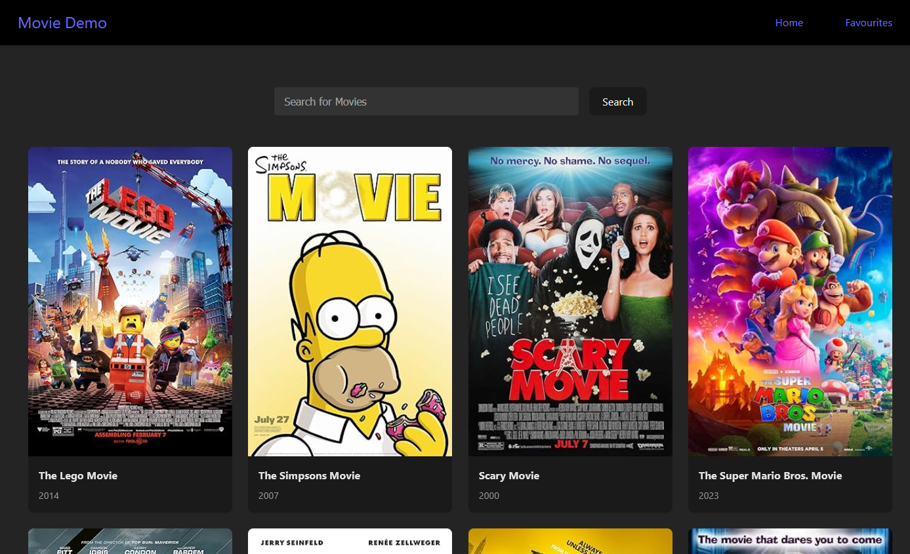
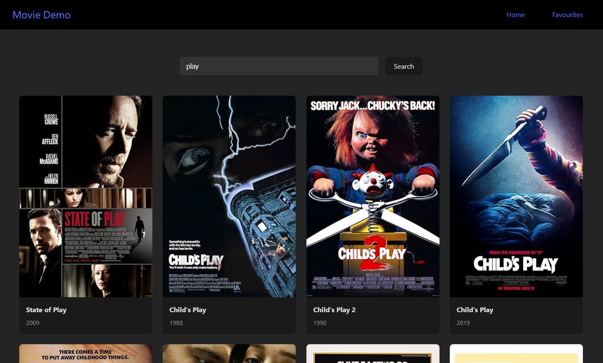
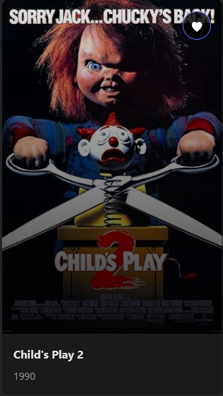
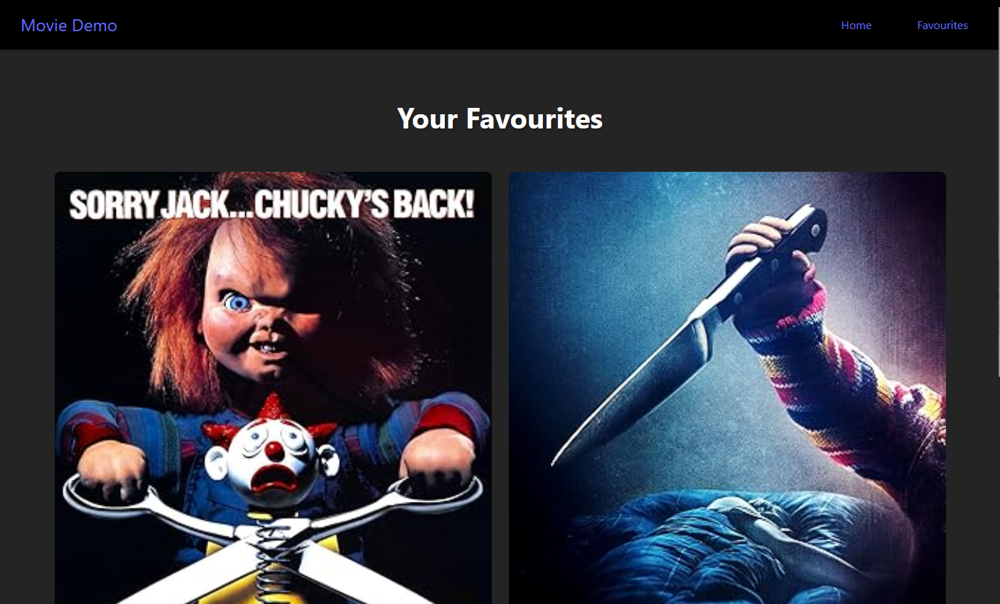

# MovieDemo

MovieDemo is a dynamic movie discovery platform built using React. Allowing users to search movie titles and explore movies on the homepage with data retrieved from the Open Movie Database API (OMDbAPI). It displays results as interactive cards and users can favourtie movies they enjoyed.

## Homepage

## Searching Functionality

## Favouriting Movie

## Favourites Page

